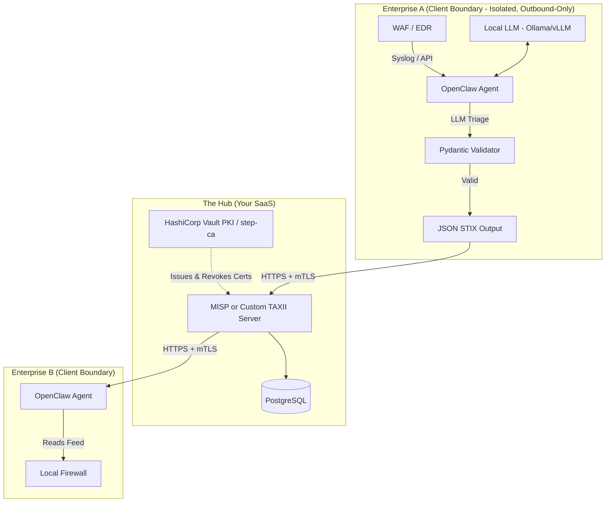

# Pragmatic Threat Intelligence Syndicate - Architecture

*Note: This architecture focuses on proven, boring, and highly effective enterprise standards that a small team can actually build, maintain, and sell. It is designed to survive a CISO's technical review by prioritizing data privacy, strict access control, and industry-standard protocols.*

## 1. Core Philosophy: Architecture by Requirements
The goal is to enable enterprise-to-enterprise threat intelligence sharing using OpenClaw as the autonomous analyst. We rely on industry-standard protocols that enterprises already trust and use daily.

*   **Trust & Identity:** Mutual TLS (mTLS) backed by a managed PKI.
*   **Data Format:** STIX 2.1 (Structured Threat Information Expression).
*   **Distribution:** A centralized MISP (Malware Information Sharing Platform) hub or a custom TAXII server.
*   **Data Privacy:** 100% on-premise execution (Bring Your Own Compute).

## 2. High-Level Architecture Diagram

## 3. Component Breakdown

### A. The Hub (Your Central Infrastructure)
You host a centralized hub. This is standard B2B SaaS.
*   **Tech Stack:** A standard Python/Node.js REST API, or an off-the-shelf **MISP** instance.
*   **Certificate Authority (CA) Operations:** Issuing certs is easy; managing them is hard. The Hub integrates a dedicated PKI component like **HashiCorp Vault PKI** or **step-ca**. This handles certificate lifecycle management, including automated rotation and, critically, Certificate Revocation Lists (CRLs) or OCSP, allowing you to instantly sever a compromised client's access.
*   **Authentication:** **mTLS (Mutual TLS)**. When an enterprise uploads data, the server cryptographically verifies their identity against the active PKI registry.

### B. The Edge (OpenClaw Agent)
OpenClaw is deployed as a hardened Docker container within the enterprise's network (`--cap-drop=ALL`, non-root, read-only filesystem).
*   **Data Privacy (Crucial for SOC2/HIPAA):** The LLM inference **must run locally** within the enterprise boundary (e.g., using Ollama or vLLM packaged in the container, or a BYOK connection to their internally approved vendor). Raw WAF/SIEM logs *never* leave the enterprise network, ensuring complete data sovereignty.
*   **Analysis & Formatting:** The local LLM evaluates logs. If deemed a threat, it maps the data into standard **STIX 2.1** JSON format.
*   **Action:** It uses the enterprise's client certificate to POST the STIX data to your Hub.

## 4. Realistic Threat Model & Mitigations

### A. Prompt Injection (Structural vs. Semantic)
*   **Structural Injection (The App Crashes):** If an attacker tricks the LLM into outputting a bash command instead of JSON, the deterministic **Pydantic Schema Validator** catches the malformed output, crashes the pipeline, and drops the payload.
*   **Semantic Injection (The Feed is Poisoned):** An attacker tricks the LLM into outputting a *perfectly valid* STIX object, but it flags a benign IP (e.g., a competitor's API or `8.8.8.8`) as malicious. 
*   **Mitigation (Network-Wide HITL):** Schema validation cannot catch semantic lies. Therefore, the Hub enforces a Human-In-The-Loop (HITL) policy for **all newly seen IOCs** (Indicators of Compromise). The first time *any* IP or Hash is reported network-wide, it must be reviewed before it is pushed to automated blocking feeds.

### B. Trust Decay & Garbage In, Garbage Out (GIGO)
mTLS proves *identity*, not *honesty*. A valid, authenticated enterprise could still have a compromised environment pumping garbage into the Hub.
*   **Anomaly Detection:** The Hub monitors submission patterns. If Enterprise A normally submits 2 IPs a week and suddenly submits 500 IPs in an hour, the Hub automatically quarantines their feed and alerts an admin.
*   **Score Decay:** Confidence scores are not static. A client's reputation score decays over time if their submitted IOCs are not corroborated by other members of the syndicate.
*   **The Kill Switch:** If a client is confirmed to be compromised or acting maliciously, their client certificate is immediately revoked via the CRL, instantly halting their ability to read or write to the Hub.

## 5. Operational Maturity & Known Limitations

To set proper expectations during a technical review, the following operational realities must be accounted for:

### A. The HITL Scalability Bottleneck
*   **Limitation:** Requiring human review for *every* newly seen IOC network-wide will quickly overwhelm the review team once the syndicate scales past a few enterprises, leading to rubber-stamping or blocked queues.
*   **Roadmap Mitigation:** Implement cross-corroboration auto-approval. If an IOC is reported by a single enterprise, it requires HITL. If the exact same IOC is reported independently by 2+ enterprises within a short time window (e.g., 1 hour), it bypasses HITL and is automatically approved for the feed.

### B. The Reputation Cold-Start Problem
*   **Limitation:** Trust decay and cross-corroboration do not work when you only have 3 beta customers (everything is novel, so nothing can be corroborated).
*   **Roadmap Mitigation:** Implement a "Manual Trust Bootstrapping" policy for the first N enterprises. The founding members are manually assigned high baseline trust scores, and manual analyst review acts as the primary defense against GIGO until critical mass is reached.

### C. Hardware Requirements for Local LLMs
*   **Limitation:** Running local LLM inference (Ollama/vLLM) inside the OpenClaw Docker container is not a "lightweight" deployment. It requires the enterprise to provision GPU-capable hardware or high-RAM instances, which increases deployment friction.
*   **Roadmap Mitigation:** Explicitly document the minimum hardware specs (e.g., VRAM requirements for specific model sizes) in the sales/deployment materials. Offer a BYOK (Bring Your Own Key) fallback option for enterprises willing to accept the privacy trade-off of using a hosted LLM API (like Azure OpenAI) under a BAA/DPA.
